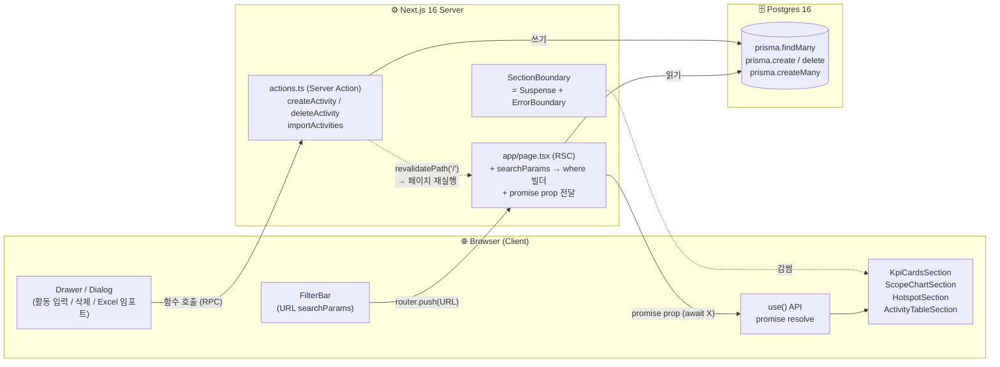
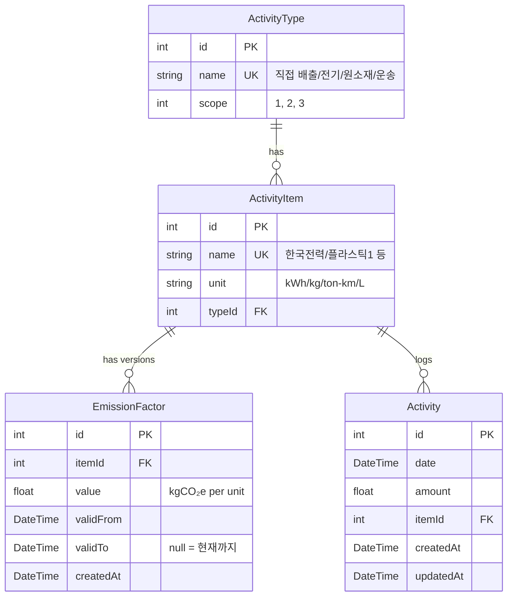

# HanaLoop PCF Dashboard

> 제품 탄소발자국 (Product Carbon Footprint) 대시보드 — Next.js 16 + Prisma 7 + PostgreSQL
> HanaLoop 프론트엔드 채용 과제 (2026-05-26 제출)

월별 활동 데이터(전기 사용량, 원소재, 운송 등)를 입력하면 **시점별 배출계수를 자동 매칭**하여 Scope 1/2/3 단위로 시각화합니다.

---

## 🚀 빠른 실행 (5단계)

> Docker가 설치되어 있어야 합니다. 그 외는 모두 자동.

```bash
# 1. 클론
git clone https://github.com/kwonjin2/hanaloop-pcf-dashboard.git
cd hanaloop-pcf-dashboard

# 2. 의존성 설치
yarn install

# 3. Postgres 실행 + 환경변수 셋업
cp .env.example .env
docker compose up -d

# 4. DB 마이그레이션 + 시드
yarn prisma migrate deploy && yarn prisma db seed

# 5. 개발 서버 실행
yarn dev
# → http://localhost:3000
```

> **production 빌드 확인**: `yarn build && yarn start`

---

## ⏱️ 작업 소요 시간

**총**: 4일

| 단계 | 주요 결과물 |
|---|---|
| 사전 도메인 학습 + 스택 결정 | PCF/GHG Scope 학습, 스택 비교, AGENTS.md 작성 |
| 셋업 + 인프라 | Next.js 16, Postgres + Docker, Prisma 7, shadcn |
| 도메인 모델 + 계산 엔진 | 스키마/마이그레이션, 시드, 시점 매칭 로직 + 단위 테스트 |
| 대시보드 + 필터 (RSC 리팩토링) | KPI/차트/테이블, 필터, RSC + `use()` + Server Action 전환 |
| 입력 폼 + Excel 임포트 + Tooltip + 마무리 | RHF+Zod 입력/삭제, SheetJS 임포트, 도메인 용어 Tooltip, README |

### 시간이 많이 소요된 부분

1. **Prisma + DB 스키마 설계 (전부 처음)** — ORM 자체가 처음. 관계 모델(`ActivityType` ↔ `ActivityItem` 분리, `EmissionFactor` 시점 버전 관리), 마이그레이션 흐름, 시드 데이터 작성 모두 학습하면서 진행. 도메인을 데이터 모델로 떨어뜨리는 사고 과정이 가장 시간이 걸림.
2. **Excel 파일 업로드 흐름** — `<input type="file">` 자체는 이전 프로젝트에서 이미지 업로드로 다뤘지만, `File → ArrayBuffer`로 Server Action에 binary 전달, SheetJS xlsx 파싱, 행별 검증 + composite key Set 기반 dedupe는 모두 첫 적용. 학습 + 시행착오에 시간 들었음.
3. **RSC + Server Action 패러다임 학습** — TanStack Query / Route Handler 기반에서 Next.js 16 정석(RSC + `use()` API + Server Action)으로 전환. SSR 충돌 디버깅과 공식 docs 검증 반복.

---

## 🖼️ 데모

### 핵심 화면 요약

| 화면 | 설명 |
|---|---|
| 메인 대시보드 | KPI 5개 + Scope 도넛 + 월별 라인 + Hotspot + 활동 테이블 |
| 활동 추가 Dialog | RHF + Zod 검증 + 즉시 반영 |
| Excel 임포트 Dialog | 명세 Excel 그대로 업로드 + dedupe |
| 활동 삭제 confirm | destructive 작업 의도 확인 |
| 도메인 용어 tooltip | Scope/계수/단위 hover 학습 |

### 📸 스크린샷

**메인 대시보드** — KPI 5개 + 차트 3종 + 활동 테이블 한 화면


---

**활동 추가 Dialog** — RHF + Zod 검증


---

**Excel 임포트 Dialog** — 명세 Excel 그대로 업로드 + 결과 카드


---

**활동 삭제 confirm** — destructive 작업 의도 검증


---

**도메인 용어 tooltip** — 비전문가 hover 학습


---

### 🎬 시연 영상

**1. 초기 데이터 (시드)** — `prisma/seed.ts`로 2024 historical 33건 + 계수 10건 초기화. 페이지 로드 즉시 모든 view 표시.

https://github.com/user-attachments/assets/722e283a-9fb7-4657-9c40-ea4819c086b8

---

**2. Excel 임포트** — 명세 "과제용 데이터" Excel을 가공 없이 그대로 업로드. 중복(같은 일자 + 항목 + 량)은 자동 dedupe, 시점 매칭으로 2025 계수 자동 적용.

https://github.com/user-attachments/assets/dbb7c235-b133-433a-8c67-3c58ad2c749f

https://github.com/user-attachments/assets/049c42cc-d802-405e-b7f7-29fa3fdd2f1b

---

**3. 필터 + YoY** — 연도 / Scope / 활동 유형으로 데이터 좁히기. "전체 기간" 선택 시 전년 대비(YoY) KPI 활성.

https://github.com/user-attachments/assets/085686ae-f0fa-4f9f-a94d-2c7953d0e5dc

---

**4. 활동 추가** — RHF + Zod 검증으로 즉시 사용자 피드백. 저장 시 모든 view 자동 갱신. 기본 view는 ESG annual report 표준에 맞춰 최신 연도.

https://github.com/user-attachments/assets/a2a4325a-2854-45c6-afce-24475c54a405

---

**5. 활동 삭제** — destructive 작업이라 confirm Dialog로 의도 검증 후 삭제.

https://github.com/user-attachments/assets/852f6355-4e15-489a-a7ac-7d111e32556d

---

**6. 도메인 용어 tooltip** — PCF / Scope / 배출계수 / 단위 등을 hover로 즉시 학습.

https://github.com/user-attachments/assets/0b7f6560-a480-4e0a-8142-0870c8cffd7d

---

## 🏗️ 시스템 설명 + 설계

### 시스템 아키텍처



**핵심 패턴**:
- **RSC + `use()` API**: `app/page.tsx`가 server에서 prisma 직접 호출 → promise를 client component에 prop으로 전달 → `use()`로 resolve
- **Suspense + ErrorBoundary로 섹션별 fault isolation**: 한 섹션 실패가 다른 섹션을 막지 않음
- **URL searchParams = 단일 진실 원천**: 필터 상태가 URL에 직접 저장 → 새로고침/공유/뒤로가기 자연 작동
- **Server Action으로 mutation**: 활동 추가/삭제/Excel 임포트. `revalidatePath('/')` 한 줄로 모든 view 자동 갱신
- **시점 기반 계수 매칭**: `lib/emissions.ts`의 `findFactor`가 활동 일자에 맞는 계수 자동 선택

### 디렉토리 구조

```
hanaloop-pcf-dashboard/
├── app/
│   ├── page.tsx              # RSC 대시보드 (entry)
│   ├── layout.tsx            # Provider + Toaster + lang ko
│   ├── actions.ts            # Server Actions (createActivity / deleteActivity / importActivities)
│   └── globals.css           # Tailwind v4 + shadcn theme
├── components/
│   ├── common/               # 범용 (ErrorBoundary, SectionBoundary, TermTooltip 등)
│   ├── dashboard/            # 대시보드 컴포넌트
│   │   ├── *Section.tsx      # client wrapper (use API)
│   │   ├── *Chart.tsx        # 순수 표현 (Recharts)
│   │   ├── *Skeleton.tsx     # Suspense fallback
│   │   ├── KpiCards.tsx      # KPI 5개
│   │   ├── ActivityTable.tsx # 활동 내역
│   │   ├── FilterBar.tsx     # 필터 (연도/Scope/항목)
│   │   ├── ActivityFormDialog.tsx     # 활동 입력
│   │   ├── ImportExcelDialog.tsx      # Excel 임포트
│   │   └── DeleteActivityButton.tsx   # 삭제 + confirm
│   └── ui/                   # shadcn primitives (copy-paste)
├── lib/
│   ├── emissions.ts          # 도메인 계산 (시점 매칭 + 5종 집계)
│   ├── emissions.test.ts     # 18 cases
│   ├── filters.ts            # URL → Prisma where 빌더
│   ├── filters.test.ts       # 12 cases
│   ├── format.ts             # 숫자/단위/날짜 포맷
│   ├── format.test.ts
│   ├── glossary.ts           # 도메인 용어 사전
│   ├── prisma.ts             # Prisma client singleton
│   ├── utils.ts              # shadcn cn()
│   └── validators/activity.ts  # Zod 스키마
├── prisma/
│   ├── schema.prisma         # 4 모델
│   ├── migrations/
│   └── seed.ts               # 2024 historical 33건 + 계수 10건
├── docker-compose.yml        # Postgres 16
└── package.json
```

### 데이터 모델 핵심 결정

- **`ActivityType` ↔ `ActivityItem` 분리**: 변경 주기/책임 분리 (Scope 분류는 타입, 단위는 항목)
- **`EmissionFactor` 별도 테이블 + `validFrom`/`validTo`**: SCD Type 2 패턴 (immutable append, 과거 보고서 재생성 정확)
- **`Activity`에 unique 제약 없음**: "같은 일자 + 같은 항목 여러 행은 별개 측정" 도메인 결정 (AGENTS.md)

---

## 📊 ERD



---

## 🛠️ 기술 스택

| 영역 | 선택 |
|---|---|
| **Framework** | Next.js 16 (App Router, React 19, Turbopack) |
| **DB / ORM** | PostgreSQL 16 (Docker) + Prisma 7 (driver adapter) |
| **UI** | shadcn/ui (Radix primitives + Tailwind v4) |
| **Charts** | Recharts |
| **Form** | React Hook Form + Zod (`@hookform/resolvers`) |
| **Excel** | SheetJS (xlsx) |
| **Notification** | sonner |
| **Test** | Vitest |
| **Lang** | TypeScript (strict) |

**상태 관리**: 외부 상태/데이터 페치 라이브러리 0 (TanStack Query / Zustand 폐기)
- Server 데이터: RSC + `use()` API
- URL 상태 (필터): `useSearchParams` + `useRouter`
- Form 상태: React Hook Form
- Mutation + 캐시 갱신: Server Action + `revalidatePath`

---

## 🤖 AI 도구 사용 내역

### 사용 도구
- **Claude Code** (Opus 4.7) — 시니어 멘토 역할: 도메인 학습, 아키텍처 검토, 코드 가이드, boilerplate 작성
- **Next.js 16 / Prisma 7 / Recharts 공식 docs** — 라이브러리 정답 검증

### 역할 분담
| 영역 | AI 역할 | 본인 역할 |
|---|---|---|
| 도메인 학습 (PCF/GHG Scope) | 개념 설명, Q&A | 학습 후 도메인 결정에 반영 |
| 아키텍처 의사결정 | trade-off 옵션 비교 + 공식 docs 인용 | **최종 채택/거절 본인** |
| 스키마 설계 | 도메인 패턴 제안 (SCD Type 2 등) | 도메인 분석 → 4-table 결정 → 직접 작성 + 마이그레이션 반복 |
| 유틸/도메인 코드 | 작성 (사용자 요청 시) | 코드 리뷰 + dead code 캐치 + 의도 검증 |
| README 작성 | 초안 작성 + Mermaid (시스템 아키텍처 / ERD) 다이어그램 | 구조/문체 검토 + 불필요 섹션 제거 |
| **모든 의사결정** | 옵션 제시 | **최종 결정 본인** (거부/조정 6건 명시) |

### AI 제안을 거부/조정한 사례 (요약)

1. **Prisma 6 → Prisma 7 채택** — AI는 학습 자료 부족 이유로 보수적 권장, 본인이 공식 docs 직접 확인 후 7 결정
2. **4페이지 구조 → 단일 페이지** — 명세 "대시보드 하나" 직접 인지하고 변경
3. **시드 전략** — Excel과 중복 안 되게 2024 historical로 시드 분리 (시점 매칭 demo 강화)
4. **TanStack Query → RSC + `use()` API** — Next.js 16 docs 직접 확인 후 정석 패턴으로 전환
5. **Zustand → URL searchParams** — 같은 흐름. 외부 상태 라이브러리 폐기
6. **Route Handler → Server Action** — Next.js 16 docs상 "Route Handler = public endpoint" 확인 후 내부 mutation은 Server Action으로 통일

→ **공통 패턴**: AI 일반론 → 본인 push-back → 공식 docs 검증 → 결정. 결과적으로 외부 의존성(라이브러리)을 크게 줄이며 best practice 도달.

---

## 📌 Assumptions (가정 사항)

### 데이터
- **2024 계수 임의 생성**: 명세 Excel에 2025 계수만 있음 → 2024는 ~2-3% 더 높게 임의 생성 (전력망 탈탄소화 추세 모방). 시점 매칭 demo 목적
- **Scope 1 demo 데이터 추가**: 명세 Excel에 없는 임의 항목
  - ActivityItem: 회사 차량 휘발유 (L)
  - EmissionFactor: 2.31 kgCO₂e/L (2024), 2.30 (2025) — 한국 환경부 휘발유 표준 근사
  - Activity: 2024년 3건 (50L, 60L, 55L)
  - ESG 보고 표준의 "모든 Scope 완전성 demo" 목적
- **시드는 모두 2024**: Excel 임포트가 2025를 담당하는 시점 분리 패턴

### UI/UX
- **연도 default = 최신**: searchParams 비면 자동 최신 연도 적용 (ESG annual report 표준)
- **필터 = 연도/Scope/항목**: 날짜 from/to UI는 인지 부담 회피로 제거. URL `?from=...&to=...` 직접 조작 시 작동 (lib/filters.ts 로직 유지)
- **페이지네이션 없음**: 60행 규모 + 필터로 충분. 1000+ 행 누적 시 server-side pagination 추가 예정
- **계수 입력 UI 없음**: 명세 요구는 "DB 설계 + 버전 이력"이라 schema 충족. 계수 추가는 prisma seed 또는 DB 직접

### Dedupe (Excel 임포트)
- 기준: 같은 **일자 + 항목 + 활동량** 정확 일치 시 skip
- 기존 DB + 같은 파일 내 중복 모두 막음
